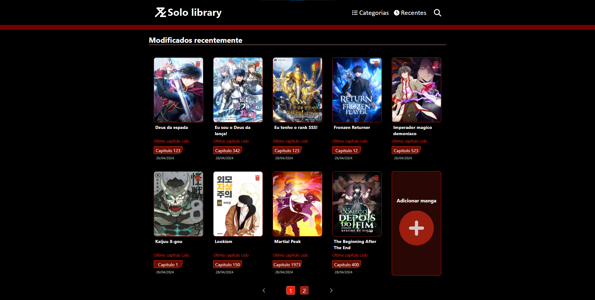

# manhwa-library-angular

Projeto pessoal para armazenar informações de controle para os manhwas, mangas e webtoons que estou lendo.

# Telas
Tela inicial - HOME  



Tela de inserção de novos livros


Tela de detalhes do livro 


## Como usar

Certifique-se de que o Node.js e o npm estejam instalados em sua máquina antes de prosseguir. Você pode instalar o Angular CLI globalmente utilizando o seguinte comando:

```npm install -g @angular/cli```

Com o Angular CLI instalado, você estará pronto para instalar as dependências do projeto e executá-lo localmente.

Ao clonar o repositório, instale as dependências utilizando o seguinte comando:  

```npm install```  

Após instalar as dependências, execute o seguinte comando na pasta do projeto para iniciar o servidor de desenvolvimento:

```ng serve``` 

Isso irá compilar o frontend da sololibrary e iniciar o servidor local.

Certifique-se de também iniciar o backend para a conexão com a API e o banco de dados.

## Dependências

Para rodar o projeto Angular, você precisará das seguintes dependências:

Node.js  
npm (Node Package Manager)  
Angular CLI (Command Line Interface)   
Conexão e alteração das variaveis de configuração do firebase para sua base pessoal.